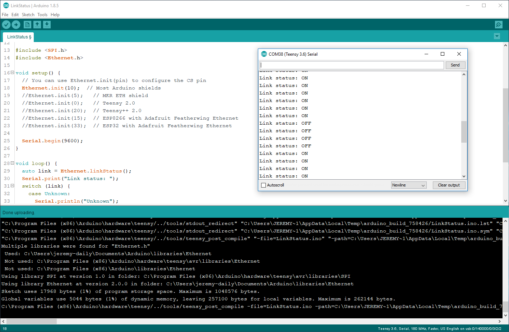

These lessons are designed to walk you through using the different features of the CAN to Ethernet board based on the Teensy 3.6.
# Assumptions
 * You have a fully populated CAN to Ethernet board
 * You are using your own private Ethernet connection where you are the administrator. Please don't connect to a production network at school or work.
 * You have access to a known good CAN network. A testbed with CAN is the best resource. The cables shown in the project are for heave vehicle diagnostic ports following SAE J1939.
 * You have Arduino and Teensyduino installed on your computer. These lessons were written using Arduino 1.8.5 and Teensyduino 1.42

# Lesson 1 - Link Status
## Procedure
  1. Connect your board to an Ethernet and Ethernet switch.
  2. Open the LinkStatus example from the Ethernet library
  3. Uncomment the `Ethernet.init(10);` line to select pin 10. Verify this is the correct pin by examining the schematics
  4. Under Sketch, select Upload and verify the compile and upload. Troubleshoot as nescessary.
  5. Open a Serial terminal and show the output. Unplug and replug the Ethernet cable to show a change in the link status.
## Deliverable
Capture a screenshot your code and the serial terminal output. Print the screenshot with your name on it and submit it to your instructor. The screenshot should look something like this:

